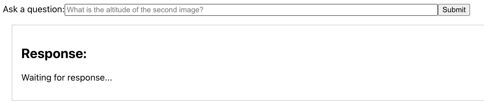
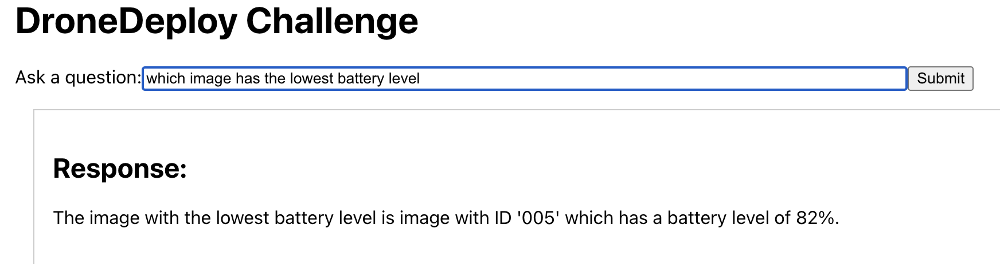
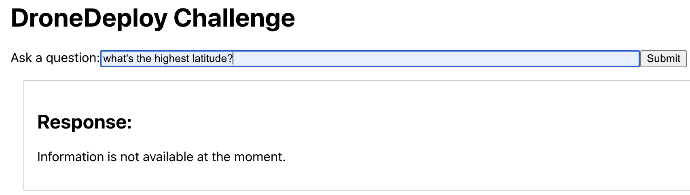
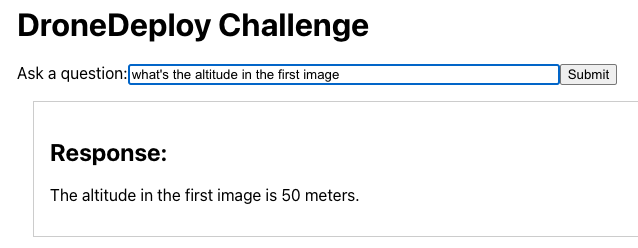
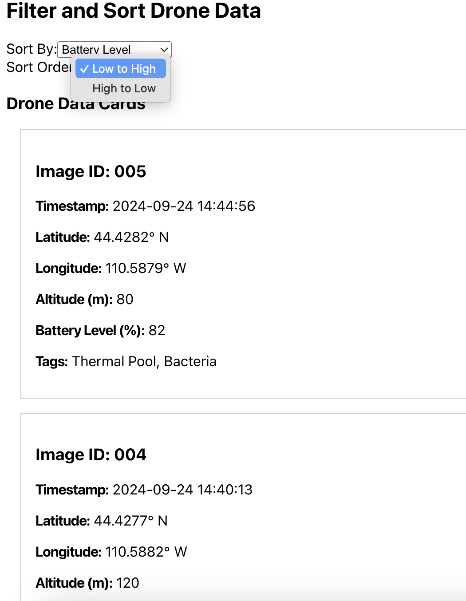

# Drone Bot

This web application uses React for the frontend and Python with Flask for the backend to allow users to interact with predefined drone data. Users can view and sort the drone data, as well as ask questions, which are handled by the OpenAI API or a fallback response if AI is not feasible.


## File Structure

- **`drone-data-backend/`**: Backend directory (Python and Flask application).
- **`src/`**: Frontend directory (React application).
- **`image_data.json`**: JSON file containing the drone data used in the application.

## Project feature
- A clean, responsive UI that allows users to input and receive information.

- Use a OpenAI service to interpret the question and handle natural language queries.

- If AI integration is not feasible, provide a mock response.


- Sorting feature to present the drone data card based on user-selected criteria.

- Basic unit tests

## Installation

### Clone the Repository and Run Backend

1. **Clone the Repository**:
    ```bash
    git clone https://github.com/EmmaBin/intern-challenge.git
    cd intern-challenge
    ```

2. **Set Up Backend**:
    ```bash
    cd drone-data-backend
    python3 -m venv venv
    source venv/bin/activate  # On Windows use: venv\Scripts\activate
    pip install -r requirements.txt
    ```

3. **Create Your `.env` File**:
    - Create a `.env` file in the `drone-data-backend` directory:
        ```bash
        touch .env
        ```
    - Open the `.env` file and add the following line:
        ```env
        REACT_APP_OPENAI="your_openai_api_key"
        ```
    Replace `"your_openai_api_key"` with your actual OpenAI API key.

4. **Run Backend**:
    ```bash
    python3 app.py
    ```
    The backend server will start at `http://127.0.0.1:5000/`.

### Run Frontend

1. **Navigate to the Frontend Directory**:
    ```bash
    cd intern-challenge #go back to root directory
    ```

2. **Install Frontend Dependencies**:
    ```bash
    npm install
    ```

3. **Start the React App**:
    ```bash
    npm start
    ```
    This will start the React app, and it will open in your browser at [http://localhost:3000/](http://localhost:3000/).

### Run Testing

#### Frontend Testing
1. **Navigate to the Frontend Directory**:
    ```bash
    cd intern-challenge
    ```

2. **Run Frontend Tests**:
    ```bash
    npm test # You may need to press 'a' to run all tests
    ```

#### Backend Testing
1. **Navigate to the Backend Directory**:
    ```bash
    cd intern-challenge
    cd drone-data-backend/
    ```

2. **Activate the Virtual Environment**:
    ```bash
    source venv/bin/activate  # On Windows use: venv\Scripts\activate
    ```

3. **Run Backend Tests**:
    ```bash
    python test_app.py
    ```